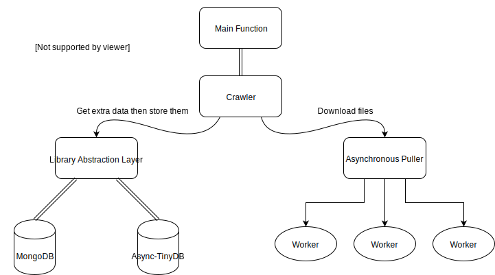
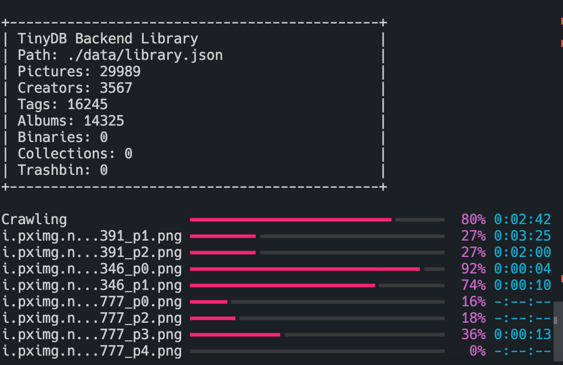
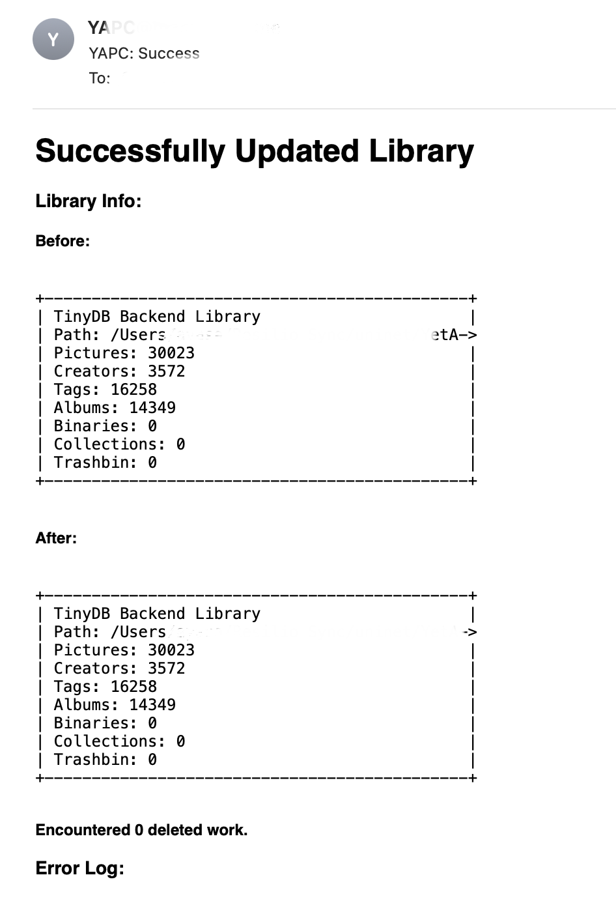
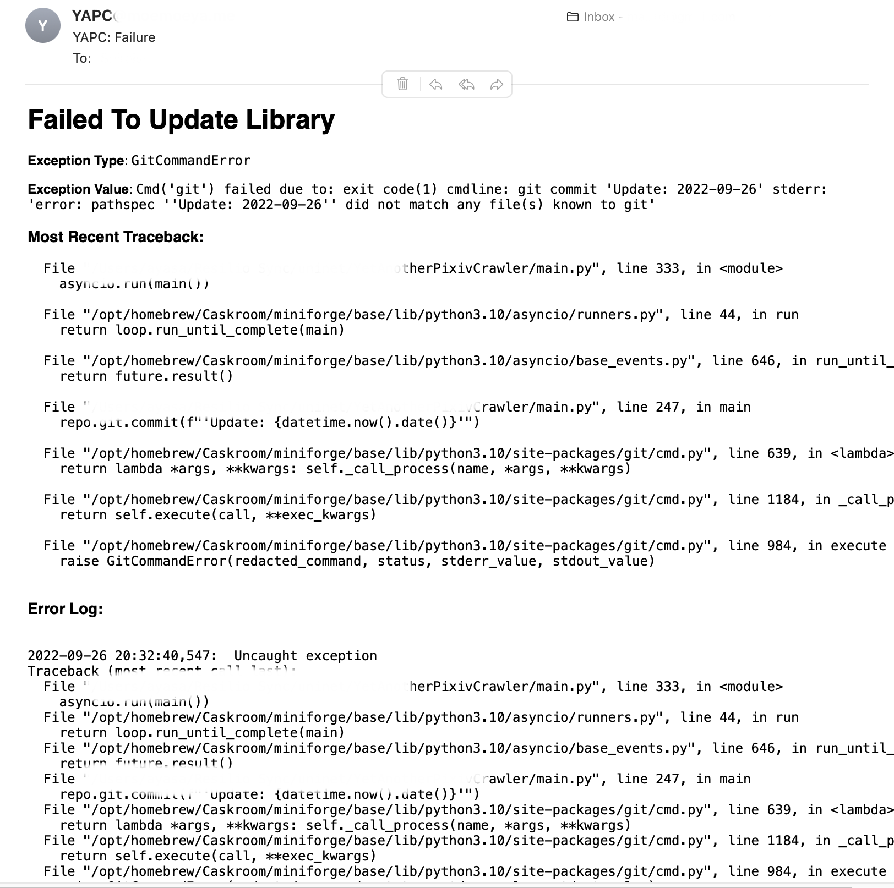

# Yet Another Pixiv Crawler

### Intro

Are you tired of finding out the works you liked are deleted or set to private? 

YAPC is the answer to that.

YAPC is designed to automatically download your bookmarks from Pixiv with extra info such as their author, PID and tags... Then save them to a database. 

**Although YAPC is designed for Pixiv, the data model used in the database isn't**. The data model is a more generic one that I use to save all my data. So you may find some "unnecessary" information in the database.  To find the prototypes of all items, go to _./library/prototypes.py_.

### Features

* Async Downloader: Shipped with an asynchronous downloader
* Database Support: Supports `Async-TinyDB` and `MongoDB` as database backends.
* Notification: Notify you of the status of your task
* Git VCS: When using `Async-TinyDB` as the backend, you can enable auto git commit and push

### Notices

If you run into any problems, maybe you should check out [this.](#Common-Questions)

Version Notes:

* v0.1.0: YAPC is not considered stable yet

### Hierarchy



### Usage

1. [Preparation](#Preparation)
2. [Configuration](#Config)
3. [Ready-to-go](#Running)
4. [Extra Features](#Advanced)

#### Preparation

###### Dependencies

`pip install -r requirements.txt`

###### Webdrivers

It is only needed if you want to get cookies from the built-in selenium script.**

You will need to download the webdriver that matches your browser. Some webdrivers are shipped with the browser but require you to enable them manually (e.g. Safari).

Currently, four browsers are supported: Safari, Chrome, Firefox and Edge.

After logging, if you've set `keep_cookies` to `true` in the config file(by default, it is `true`), the cookies file will be saved to _./data/cookies.json_ 

###### Convert MongoDB To Replica Set

**It is only needed if you choose `mongoend` as the backend.**

To use transactions in YAPC `mongoend`, your MongoDB server should switch to replica set mode following [this page.](https://www.mongodb.com/docs/manual/tutorial/convert-standalone-to-replica-set/)

Or, in short, add these lines to your `mongos` config.

```
replication:
  replSetName: node0
```

Then, restart your `mongos`, connect via `mongosh` and type.

```
rs.initiate()
```


#### Config

Run `main.py` to generate the config file `config.yaml` and modify it.

You can delete unnecessary lines in the config and the default values.yaml` will be used.

Here I will only mention some essential options:
* `pixiv`: Pixiv-related settings
  
  * `username`: Your Pixiv username, used for login; leave it blank if you want to manually input
  
  * `password`: Your Pixiv password, used for login, leave it blank if you want to manually input
  
  * `target`: A Pixiv UID will crawl bookmarks from this account.
  
  * `offsets`
  
    * `stop` The offset of the first not-in-database work; by default; it will automatically detect,
  
      If you are running for the first time, I suggest you use the cmd options below to set `stop` to `-1`, which will crawl all bookmarks.
  
* `webdriver`

  * `browser`:  `chrome`/`safari`/`firefox`/`edge`, choose your browser.
  * `path`: path to the webdrivers folder, set to `null` will search in system `PATH`

* `puller`: Async-downloader-related settings

  * `interval`: Interval between requests in seconds; increase it if you encounter error 429.
  * `path`: Where you want to keep your illusts/manga/ugoira files
  * `overwrite`: Whether to overwrite existing files is useful when some files are corrupted due to an unexpected exit.
  * `proxies`: as the name suggests, all the requests made inside the script will use this setting; set to an empty value will use system proxies.
  
* `database`: DB-related settings

  * `backend`: `tinyend`/`mongoend`, you can easily migrate data between these backends

    `tinyend` will save your data to a JSON file, and `mongoend` will keep them to a MongoDB replica set.

  * `path`: This could be a file path or a MongoDB URI, depending on which backend you choose.


#### Running

The primary function is in _main.py_

Usually, the proper stop value will be auto-detected. So this line will do.

```bash
python main.py
```

If you are running for the first time, the code above will generate _config.yaml_, which will be your config file. Then you need to add `--stop -1` as extra arguments to start crawling from the oldest bookmark.

```bash
python main.py --stop -1
```

To view more options, run `python main.py --help`.

###### Get Cookies Via Selenium

When `Cookies` do not exist or are expired, your browser should pop up and automatically log in for you. (Assuming you have configured username/password and the webdriver mentioned above). Sometimes you have to get through that annoying Recaptcha manually.

**DO NOT CLOSE THE WINDOW MANUALLY DURING THE BROWSER LOGIN SESSION**

###### A Typical Run

In a successful run, you should see this.



***Library(aka the database) digests will be printed twice, before and after crawling. If you don't see the second one, then it's likely something went wrong. Check the error log for further information.***

### Advanced

#### Git Version Control

When using `tinyend`, set `git.enable` to `true` in your config file, and a git repo will be created under the folder where you keep your database file. Filling `git.remote` with a non-empty value will push updates to that remote.

However, if you are uploading to GitHub, when your file size exceeds 100MB, you will need [git-lfs](https://git-lfs.github.com). 

#### Notification

YAPC can notify you when a task failed to fail or failed successfully.

Currently, only mailgun is supported. To use it, fill in all the required info in the config file and set enable to `true`.

Here are some examples of notifications:

##### Failed to fail



##### Failed successfully

 

### Common Questions

> If you cannot eliminate an issue, then eliminate who discovered it. 
>
> ​																												---- Commies

* Can't push to GitHub: If your database size exceeds 100MB, [git-lfs](https://git-lfs.github.com) is required to make it.
* The progress bar is flickering: That's a Windows issue; bear with it or join the almighty *unix family.

* Well, I don't know what's the common questions since I have no samples. 

  Please submit an issue if you have any problems not listed here.

### Backends

There is an extra abstraction layer above database backends, so migrating between backends is pretty simple.

#### `tinyend`

Based on my other repo: [Async-TinyDB](https://github.com/VermiIIi0n/async-tinydb), which is based on [TinyDB](https://github.com/msiemens/tinydb).

Your database will be saved to a JSON file. The format is quite similar to what `pymongo.json_util` will generate, but not the same. (e.g. all binaries will be base64 encoded.)

#### `mongoend`

Based on `Motor`, an asynchronous version of `pymongo`

### Tools

#### Migrate Between Backends

```bash
python tools.py migrate <database_path> --to <target_database_path>
```

#### Check Errors In Your Database

**Haven't been fully implemented yet**

```bash
python tools.py check <database_path>
```


